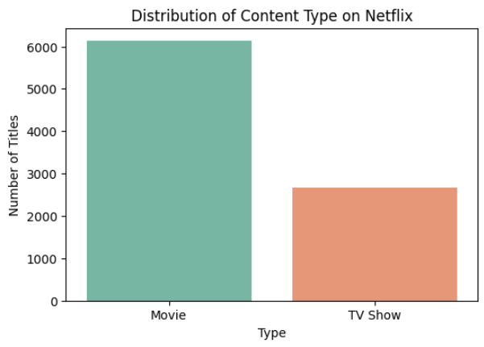
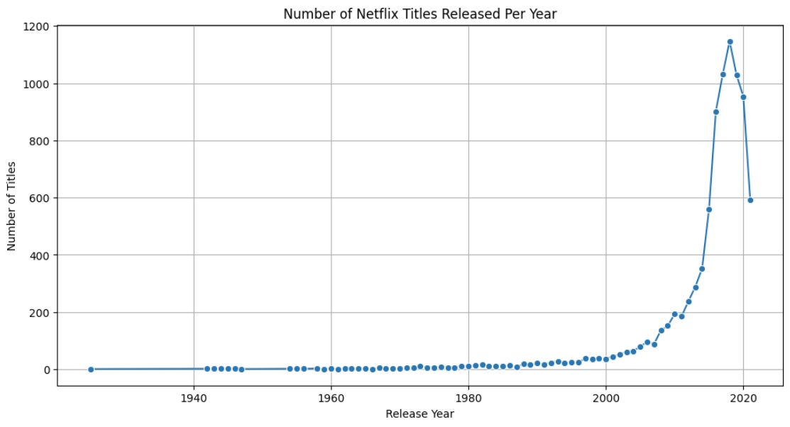
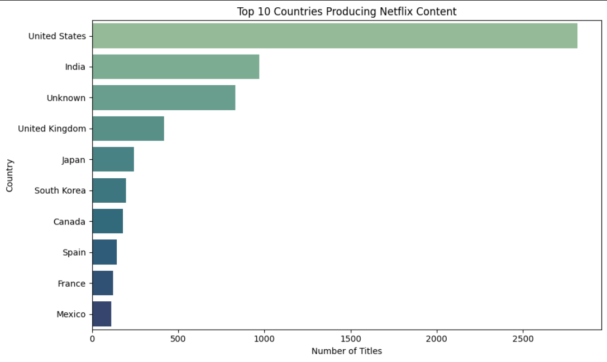
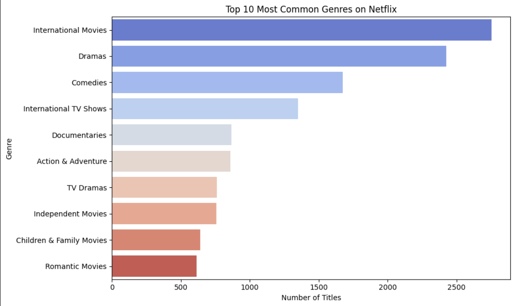

# Netflix Data Analysis 

A beginner-friendly data science project exploring trends in Netflix's movies and TV shows.

##  Objective
The goal of this project is to analyze Netflix's public content data to uncover:
  1. The distribution of content types (Movies vs TV Shows)
  2. Yearly release trends
  3. Top genres and production countries

## Tools Used
  1. Python (Pandas, Matplotlib, Seaborn)
  2. Jupyter Notebook
  3. GitHub for version control

## Sample Insights

### Content Type Distribution  
 
Conclusion: Most Netflix content is Movies 

### Yearly Release Trends  
  
Conclusion: 2018 had the highest number of releases.

### Top Production Countries  
  
Conclusion: The United States is the top content producer.

### Popular Genres  
  
Conclusion: Genres like Drama and Comedy dominate Netflix's catalog.

## How to Run

  1. Open the `notebooks/netflix_analysis.ipynb` Jupyter notebook.  
  2. Make sure you have Python packages: pandas, matplotlib, seaborn installed.  
  3. Run each cell step-by-step to replicate the analysis.

## Next Steps
  1. Deeper genre analysis
  2. Explore user ratings (if available)
  3. Try clustering or recommendation models
     

## Author
**Michaela de Bruyn**  
[LinkedIn](https://linkedin.com/in/michaela-de-bruyn)

